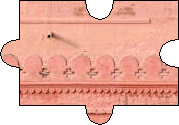

# jigsaw_maker

jigsaw maker project creates jigsaw pieces by given image.

# Usage
1. Build the application
```sh
cargo build --release
```
You can now find the executable of the application inside the ```target/release``` folder. Thereby, you can set its directory to your ```PATH``` or you can run it locally.

2. Run the application.
```sh
jigsaw_maker --file sample.jpg
```
jigsaw_maker will create 4x4 jigsaw pieces by given picture and save those pieces into ```out``` directory.

# Commands
| Command | Value | Description |
|--|--|--|
| -f, --file | String | File path option, required. |
| --column | Integer | Column count option, default value is 4 |
| --row | Integer | Row count option, default value is 4 |
| -h, --help |  | Print help|

# Example


|   |   |   |   |
| ------------ | ------------ | ------------ | ------------ |
|   |   |   |   |
|   |   |   |   |
|   |   |   |   |
|   |   |   |   |
